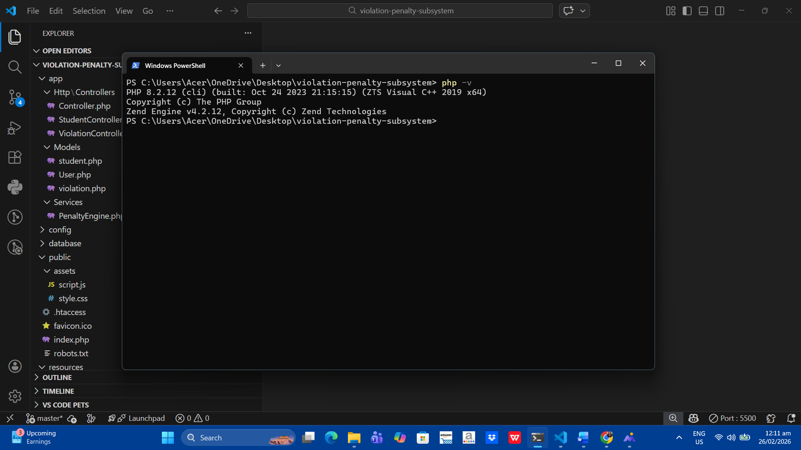

# Violation Penalty Subsystem - Environment & Workflow Setup

## 1️⃣ IDE
- **Visual Studio Code** installed and configured for PHP and Laravel development.  
- Screenshot of IDE setup:  


---

## 2️⃣ Programming Language Runtime
- **PHP 8.2.12** installed and verified:  
```bash
php -v


## 3️⃣ Laravel & Testing Framework

- **Laravel Framework (Subsystem Prepared for Laravel 12.x)**  
  The subsystem is designed to run within a Laravel project structure. Full Laravel framework is required to execute Artisan commands.
  
- PHPUnit included as the testing framework (listed in composer.json under require-dev).  


## 4️⃣ Git Repository Setup

Git initialized in project folder.

Remote repository on GitHub: violation-penalty-subsystem

Meaningful commits made for project progress.


## 5️⃣ Project Structure
violation-penalty-subsystem/
├── app/
│   ├── Models/
│         └──  Student.php
│         └──  violation.php
│   └── Services/PenaltyEngine.php
├── assets/
│   ├── style.css
│   └── script.js
├── resources/views/
│   ├── students.blade.php
│   └── violations.blade.php
├── tests/Unit/PenaltyEngineTest.php
├── .gitignore
└── README.md

## 6️⃣ Evidence of Workflow

Commands used to initialize and push repository:

git init
git add .
git commit -m "Initial commit"
git remote add origin https://github.com/sunshinellanera-ss/violation-penalty-subsystem.git
git push -u origin main


